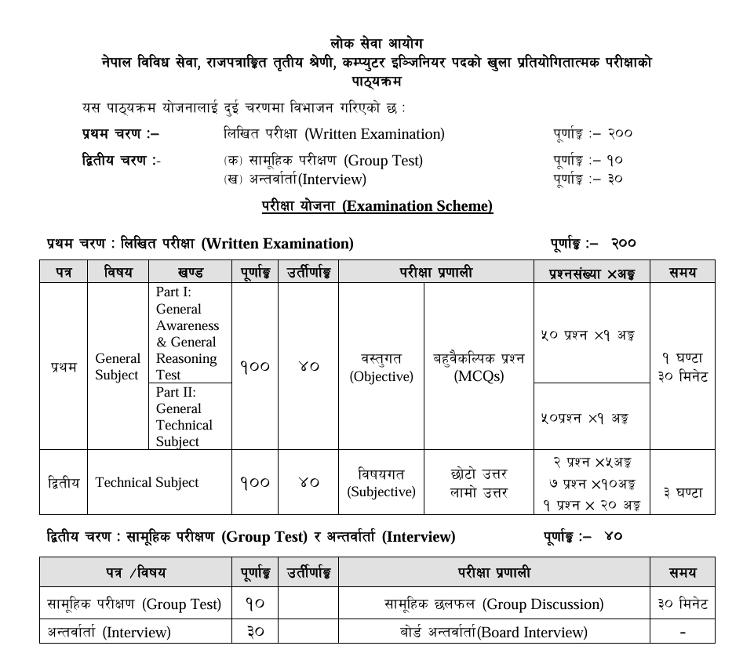

# Computer Officer

<figure><figcaption></figcaption></figure>

**Paper I: General Awareness & Technical Fundamentals**

* **Part I (General Awareness & Reasoning):**
  * Focuses on Nepal's **geography, natural resources, governance, constitution, and current affairs**.
  * Includes **logical reasoning, numerical reasoning, and spatial reasoning** for problem-solving.
* **Part II (Technical Fundamentals):**
  * Covers **computer networks, computer architecture, digital design, and basic electrical & electronics principles**.
  * Introduces **microprocessors, memory systems, and communication systems**.



***

**Paper II: Advanced Technical Subjects & Applications**

* **Section A (Core Technical Subjects - 25%):**
  * Focuses on **computer networks** (protocols, layers, routing, TCP/IP, etc.), **computer architecture** (microprocessors, memory systems, I/O organization), **digital design** (logic circuits, sequential logic, arithmetic circuits), and **basic electrical & electronics** (circuit theory, semiconductors, amplifiers).
  * Introduces **electronic communication systems** (modulation, error detection, SNR, BER).
* **Section B (Programming & Software Engineering - 25%):**
  * Covers **structured and object-oriented programming** (data types, control structures, classes, inheritance, polymorphism).
  * Explores **data structures** (linear structures, trees, graphs, sorting, hashing) and **algorithm design techniques** (greedy methods, dynamic programming, recursion).
  * Includes **software engineering principles** (lifecycle models, project management, requirements analysis, design, implementation, maintenance).
  * Discusses **database management systems** (relational model, SQL, transactions, indexing, distributed databases) and **operating systems** (processes, memory management, file systems, security).
* **Section C (Advanced Computing Topics - 20%):**
  * Focuses on **artificial intelligence** (search, NLP, learning, planning, robotics) and **theory of computation** (languages, automata, Turing machines, complexity theory).
  * Covers **compiler design** (lexical analysis, parsing, code generation, optimization) and **computer graphics** (2D/3D transformations, rendering, shading).
  * Introduces **emerging technologies** (neural networks, cryptography, embedded systems, e-commerce, GIS).
* **Section D (Practical Applications - 30%):**
  * Includes **technical writing** (proposals, essays, critiques) and **case studies** (analysis and design of software systems, integrating knowledge from software engineering, databases, and operating systems).


